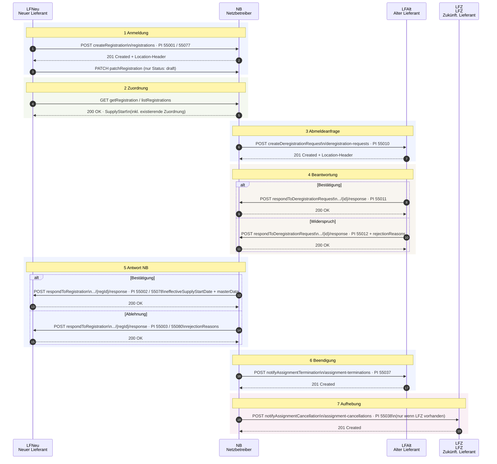

# api/ – API-Spezifikationen / API Specifications

> Deutsch und Englisch in einer README.  
> German and English in one README.

---

## DE – Überblick

Bei den API's handelt es sich ausschließlich um einen Rahmen. 
Die vorgeschlagenen API'S müssen gegen die Prozesse validiert und entsprechend angepasst werden.
Diese Schnittstelle darf in dieser Version nicht verwendet werden

Dieses Verzeichnis enthält die vollständigen OpenAPI 3.0 Spezifikationen für die
REST-APIs des GPKE/UTILMD-Projekts. Jede API-Datei ist eine eigenständige,
ausführbare OpenAPI-Spezifikation, die Schemas per `$ref` aus der zentralen
Bibliothek unter `../schema/` und HTTP-Header-Definitionen aus `../header/` bezieht.

## EN – Overview

The APIs are intended solely as a framework. 
The proposed APIs must be validated against the processes and adapted accordingly.
This interface must not be used in this version.

This directory contains the complete OpenAPI 3.0 specifications for the GPKE/UTILMD
REST APIs. Each API file is a self-contained, executable OpenAPI specification that
references schemas from the central library under `../schema/` and HTTP header
definitions from `../header/`.

---

## Dateien / Files

### `malo.yaml` – GPKE Lieferbeginn (Supply Start / Supplier Change)

Vollständige REST API für den GPKE-Prozess **SD: Lieferbeginn** (GPKE Teil 2, S. 31 ff.).
Deckt alle 7 Prozessschritte zwischen den Marktpartnern LFNeu (LFN), Netzbetreiber (NB),
LFAlt (LFA) und zukünftigem Lieferant (LFZ) ab.

Complete REST API for the GPKE process **SD: Lieferbeginn** (supply start / supplier change,
GPKE Teil 2, p. 31 ff.). Covers all 7 process steps between LFNeu (LFN), grid operator (NB),
LFAlt (LFA) and future supplier (LFZ).

#### Endpunkte / Endpoints

| # | Methode | Pfad | operationId | Prüf-ID | Schritt |
|---|---------|------|-------------|---------|---------|
| 1 | `POST` | `/malo/{marketLocationId}/registrations` | `createRegistration` | 55001 / 55077 | 1 – Anmeldung LFN→NB |
| 2 | `GET` | `/malo/{marketLocationId}/registrations` | `listRegistrations` | — | Liste |
| 3 | `GET` | `/malo/{marketLocationId}/registrations/{supplyStartId}` | `getRegistration` | — | 2 – Existierende Zuordnung |
| 4 | `PATCH` | `/malo/{marketLocationId}/registrations/{supplyStartId}` | `patchRegistration` | — | Korrektur (nur draft) |
| 5 | `POST` | `/malo/{marketLocationId}/registrations/{supplyStartId}/response` | `respondToRegistration` | 55002 / 55003 / 55078 / 55080 | 5 – Antwort NB→LFN |
| 6 | `POST` | `/malo/{marketLocationId}/deregistration-requests` | `createDeregistrationRequest` | 55010 | 3 – Abmeldeanfrage NB→LFA |
| 7 | `POST` | `/malo/{marketLocationId}/deregistration-requests/{deregistrationRequestId}/response` | `respondToDeregistrationRequest` | 55011 / 55012 | 4 – Beantwortung LFA→NB |
| 8 | `POST` | `/malo/{marketLocationId}/assignment-terminations` | `notifyAssignmentTermination` | 55037 | 6 – Zuordnungsbeendigung NB→LFA |
| 9 | `POST` | `/malo/{marketLocationId}/assignment-cancellations` | `notifyAssignmentCancellation` | 55038 | 7 – Zuordnungsaufhebung NB→LFZ |

#### Prozessablauf / Process flow



#### Vorlauffristen / Lead times (Lieferantenwechsel)

| Identifikationsfall | Vorlauf vor Lieferbeginn |
|---------------------|--------------------------|
| Fall 1 – nur MaLo-ID (`maloIdOnly`) | ≥ 7 Werktage |
| Fall 2 – Adresse / Attribute (`multiAttribute`) | ≥ 10 Werktage |

#### Fristen für NB und LFA / Deadlines for NB and LFA

| Schritt | Frist |
|---------|-------|
| Schritt 3 (Abmeldeanfrage NB→LFA) | Fall 1: bis Ende 1. WT / Fall 2: bis Ende 4. WT nach Eingang |
| Schritt 4 (Antwort LFA→NB) | bis Ende 3. WT nach Eingang der Abmeldeanfrage |
| Schritt 5 (Antwort NB→LFN) | Fall 1: bis Ende 5. WT / Fall 2: bis Ende 8. WT nach Eingang |
| Schritte 6+7 (Beendigung/Aufhebung) | am selben Kalendertag wie Schritt 5 |

---

## Diagramme / Diagrams

### `lieferbeginn-api.drawio`

DrawIO-Prozessdiagramm aller 9 API-Endpunkte als BPMN-Swimlane-Darstellung.
Zeigt Kommunikationsrichtungen, HTTP-Methoden, Pfade und Prüfidentifikatoren
für alle 4 beteiligten Rollen (LFNeu, NB, LFAlt, LFZ).

DrawIO process diagram of all 9 API endpoints as a BPMN swimlane visualization.
Shows communication directions, HTTP methods, paths and check identifiers for all
4 involved roles (LFNeu, NB, LFAlt, LFZ).

Geöffnet mit / Open with: [app.diagrams.net](https://app.diagrams.net) oder VS Code + Draw.io Extension.


---

## Sicherheit / Security

Alle API-Endpunkte verwenden ein mehrschichtiges Sicherheitsmodell. Vollständige
Dokumentation unter `docs/security/`.

All API endpoints use a multi-layer security model. Full documentation in `docs/security/`.

### Sicherheitsschichten / Security layers

| Layer | Mechanismus | RFC | Pflicht |
|-------|------------|-----|---------|
| 1 – Authentifizierung | OAuth 2.0 Bearer JWT | RFC 7519 | Ja |
| 2 – Payload-Integrität | JWS (ES256) | RFC 7515 | Ja (POST/PATCH) |
| 3 – Payload-Vertraulichkeit | JWE (RSA-OAEP-256 + A256GCM) | RFC 7516 | Optional |
| 4 – Nachrichtenintegrität | HTTP Message Signature (ECDSA P-256) | RFC 9421 | Ja |

### Neue Pflicht-Header / New required headers

```http
# Bei POST/PATCH (mit Body / with body):
Content-Digest: sha-256=:uU0p7h6qv6bqGJgYy3m8n2mY0cKc6lQ5qJv8W2r9bLk=:
Signature-Input: sig1=("@method" "@authority" "@target-uri" "content-type"
  "accept" "content-digest" "date" "x-request-id"
  "x-api-spec-ref" "x-api-spec-version");
  created=1769940930;expires=1769941230;
  keyid="client-http-sig-01";alg="ecdsa-p256-sha256"
Signature: sig1=:m1dP0w7qZ8QmM8n6f0dVbQ4h2lJd0q3H6mQkq9Vxq8g=:

# Bei GET (ohne Body / without body):
Signature-Input: sig1=("@method" "@path" "@query" "host" "date"
  "x-request-id" "x-api-spec-ref" "x-api-spec-version");
  created=1706782530;keyid="client-ed25519-01";alg="ed25519"
Signature: sig1=:MEQCIG0H4V4...==:
```

Weitere Details: [`docs/security/README.md`](../docs/security/README.md) · [`docs/security/security-flow.html`](../docs/security/security-flow.html)

---

## DE – Konventionen

- Alle Schemas werden per `$ref` aus `../schema/` bezogen, nie inline dupliziert.
- HTTP-Header (X-Message-ID, Idempotency-Key, ETag, …) werden aus `../header/headers/` referenziert.
- Alle Feldbezeichner und operationIds sind **lowerCamelCase**.
- Beschreibungen sind zweisprachig: Englisch primär, Deutsch in `x-i18n.de`.
- Fehlerantworten verwenden `../schema/common/errorResponse.yaml`.
- Alle Endpunkte erfordern `Signature` + `Signature-Input` (RFC 9421); POST/PATCH zusätzlich `Content-Digest` (RFC 9530).

## EN – Conventions

- All schemas are referenced via `$ref` from `../schema/` and never duplicated inline.
- HTTP headers (X-Message-ID, Idempotency-Key, ETag, …) are referenced from `../header/headers/`.
- All field identifiers and operationIds use **lowerCamelCase**.
- Descriptions are bilingual: English primary, German in `x-i18n.de`.
- Error responses use `../schema/common/errorResponse.yaml`.
- All endpoints require `Signature` + `Signature-Input` (RFC 9421); POST/PATCH additionally require `Content-Digest` (RFC 9530).

---

## Normative Quellen / Normative Sources

- BDEW GPKE – Geschäftsprozesse zur Kundenbelieferung mit Elektrizität (GPKE Teil 2)
- EDI@Energy Anwendungsübersicht der Prüfidentifikatoren v3.1 (01.08.2024, BDEW)
- BDEW UTILMD Anwendungshandbuch Strom 2.1 (11.12.2025)
- [www.bdew-mako.de](https://www.bdew-mako.de)
